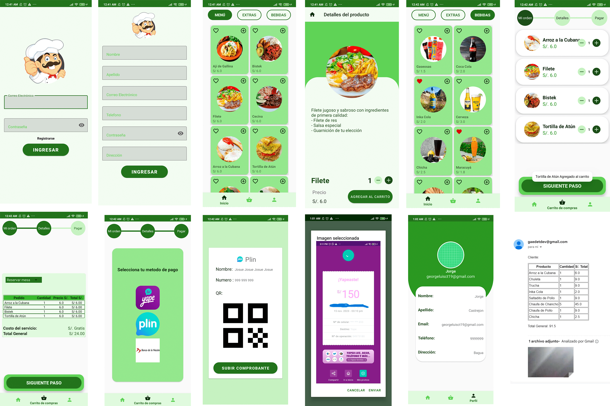

# Restaurante Móvil: Menú y Carrito de Compras

Esta aplicación básica para restaurantes ha sido desarrollada con el objetivo de simplificar la experiencia de compra de platillos para cualquier establecimiento gastronómico. Clona el repositorio y personalízalo según tus preferencias.

## Características Destacadas

- **Registro y Login Seguros:** Implementamos un sistema de registro y login seguro a través de la API de Firebase.

- **Menú Interactivo:** Ofrecemos un menú interactivo con una selección diversa de platillos. Cuenta con tres categorías y te brinda la posibilidad de añadir al carrito de compras, marcar como favoritos y visualizar información detallada de cada platillo.

- **Gestión de Carrito de Compras:** La aplicación cuenta con una interfaz de carrito de compras dividida en tres secciones estilo barra de progreso. En la primera sección, puedes disminuir, editar o eliminar los platillos seleccionados previamente. En la segunda sección, puedes verificar detalladamente cada platillo y el costo total, además de seleccionar el tipo de pedido. La última sección te permite elegir entre tres diferentes métodos de pago, y según la opción seleccionada, podrás visualizar la información necesaria para completar el pago y subir la evidencia mediante una captura de pantalla. Posteriormente, se envían los datos del pedido y la evidencia a un correo electrónico.

- **Sección de Perfil:** Los usuarios registrados pueden acceder a una sección de perfil donde visualizarán sus datos personales.

- **Envío de Confirmación por Correo:** Todos los pedidos realizados por los clientes se envían automáticamente a un correo central, permitiendo que el dueño o administrador del restaurante pueda visualizar cada solicitud de manera eficiente.

## Evidencias

El software es de uso libre, siempre y cuando se proporcionen los créditos necesarios y se utilice de manera ética. ¡Esperamos que disfrutes de la experiencia de ordenar tus platillos favoritos desde la comodidad de tu dispositivo móvil! 🍽️📱
